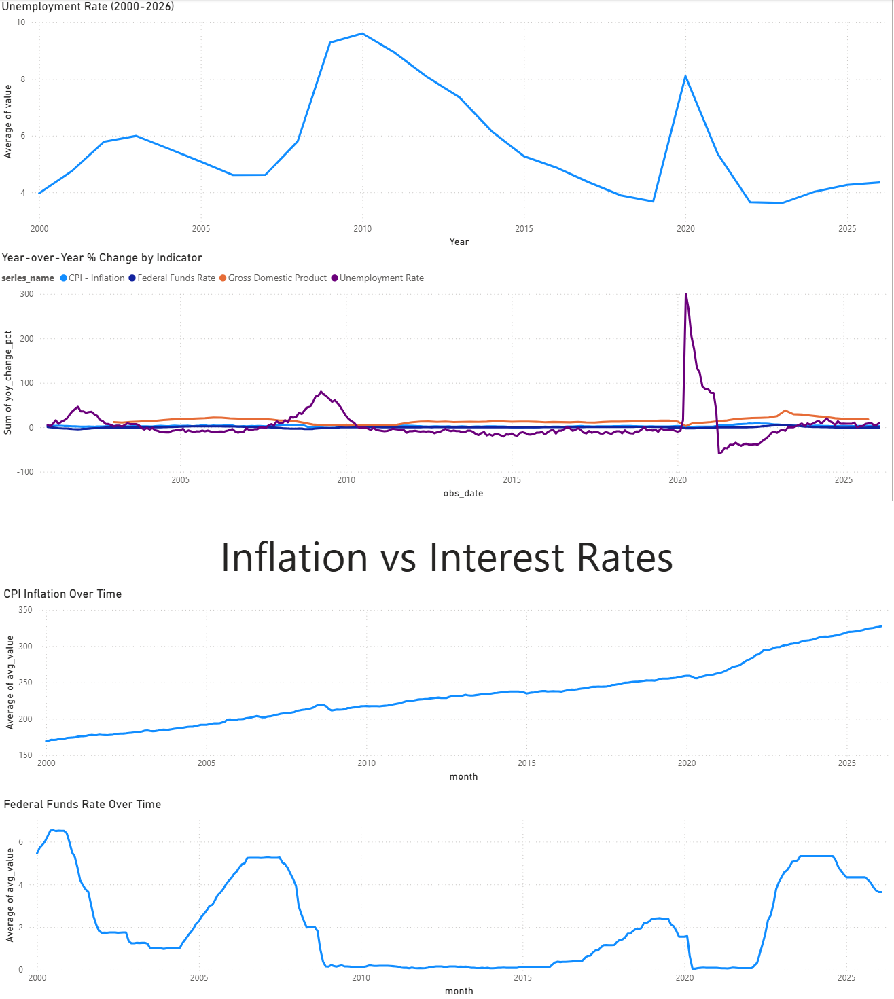

# FRED Economic Indicators Pipeline

An end-to-end data engineering pipeline that ingests macroeconomic data from the [Federal Reserve Economic Data (FRED) API](https://fred.stlouisfed.org/), stores it in PostgreSQL, orchestrates runs with Apache Airflow, transforms it with dbt, and visualizes it in a Power BI dashboard.

Built as a portfolio project to demonstrate a realistic data engineering workflow using tools commonly required in junior data engineering roles.



[View Full Dashboard PDF](assets/dashboard.pdf)

---

## Architecture

```
FRED API → Python Ingestion → PostgreSQL → dbt Transformations → Power BI Dashboard
                                   ↑
                             Apache Airflow
                          (scheduled orchestration)
```

---

## Tech Stack

| Layer | Tool |
|---|---|
| Ingestion | Python (requests, pandas, psycopg2) |
| Storage | PostgreSQL 15 |
| Orchestration | Apache Airflow 2.8 |
| Transformation | dbt (dbt-postgres) |
| Serving | Power BI Desktop |
| Containerization | Docker + Docker Compose |

---

## Data

Four macroeconomic indicators are ingested from the FRED API, starting from January 2000:

| Series ID | Indicator | Frequency | Unit |
|---|---|---|---|
| GDP | Gross Domestic Product | Quarterly | Billions of USD |
| CPIAUCSL | Consumer Price Index (Inflation) | Monthly | Index (1982-84=100) |
| UNRATE | Unemployment Rate | Monthly | Percent |
| FEDFUNDS | Federal Funds Rate | Monthly | Percent |

---

## Project Structure

```
fred-pipeline/
├── airflow/
│   ├── dags/
│   │   └── fred_ingestion_dag.py   # Airflow DAG definition
│   ├── logs/
│   └── plugins/
├── dbt/
│   └── fred_dbt/
│       └── models/
│           ├── sources.yml
│           ├── staging/
│           │   └── stg_fred_observations.sql
│           └── marts/
│               ├── mart_monthly_indicators.sql
│               └── mart_yoy_changes.sql
├── ingestion/
│   ├── db.py                       # PostgreSQL connection + table creation
│   └── ingest.py                   # FRED API fetch + load to Postgres
├── docker-compose.yml
├── .env.example
└── README.md
```

---

## dbt Models

```
raw_fred_observations (PostgreSQL / public schema)
        │
        ▼
stg_fred_observations       -- light cleaning, adds series_name and unit columns
        │
        ├──▶ mart_monthly_indicators   -- monthly averages per indicator
        └──▶ mart_yoy_changes          -- year-over-year changes per indicator
```

---

## Getting Started

### Prerequisites

- Docker Desktop (or Docker Engine + Docker Compose plugin)
- Python 3.8+
- A free [FRED API key](https://fred.stlouisfed.org/docs/api/api_key.html)

### 1. Clone the repo

```bash
git clone https://github.com/yourusername/fred-pipeline.git
cd fred-pipeline
```

### 2. Configure environment variables

```bash
cp .env.example .env
```

Edit `.env` and fill in your values:

```env
POSTGRES_USER=freduser
POSTGRES_PASSWORD=fredpass
POSTGRES_DB=freddb
POSTGRES_HOST=postgres
POSTGRES_PORT=5432
FRED_API_KEY=your_api_key_here
AIRFLOW_UID=1000
```

### 3. Set Airflow permissions

```bash
sudo chown -R 50000:0 airflow/logs airflow/dags airflow/plugins
echo -e "AIRFLOW_UID=$(id -u)" >> .env
```

### 4. Initialize Airflow

```bash
docker compose up airflow-init
```

### 5. Start all services

```bash
docker compose up -d
```

### 6. Trigger the pipeline

Open [http://localhost:8080](http://localhost:8080) and log in with `admin` / `admin`.

Find the `fred_ingestion` DAG and click the play button to trigger a run.

### 7. Run dbt transformations

```bash
cd dbt/fred_dbt
pip install dbt-postgres
dbt run
```

---

## Dashboard

The Power BI dashboard connects directly to the PostgreSQL `analytics` schema and includes:

- **Unemployment Rate Over Time** — shows the 2008 financial crisis and 2020 COVID spikes
- **Year-over-Year % Change by Indicator** — compares rate of change across all four indicators
- **Inflation vs Interest Rates** — shows the Fed raising rates in response to 2021-2022 inflation

---

## Key Concepts Demonstrated

- **Idempotent ingestion** — `ON CONFLICT DO NOTHING` prevents duplicate rows on reruns
- **Containerized services** — PostgreSQL, Airflow, and Redis all run in Docker
- **DAG-based orchestration** — Airflow schedules the pipeline every Monday at 6am
- **Layered transformations** — dbt staging and mart models follow the medallion pattern
- **Analytical modeling** — window functions (`LAG`) used for year-over-year calculations

---

## License

MIT

